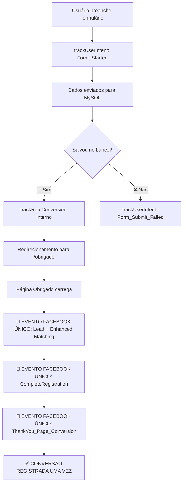

# 🎯 Facebook Pixel - Eventos Únicos - OTIMIZAÇÃO FINAL

## 🚨 Problema Identificado e Resolvido

**Duplicação de eventos Facebook Pixel causando inflação das métricas de conversão**

### ❌ **Antes da Correção:**

```
Landing Page (após salvar no banco):
├─ trackRealConversion('Lead') ✅
├─ window.fbq('track', 'Lead') ❌ DUPLICADO
└─ window.fbq('track', 'CompleteRegistration') ❌ DUPLICADO

Página de Obrigado:
├─ trackRealConversion('Lead') ✅
├─ window.fbq('track', 'Lead') ❌ DUPLICADO NOVAMENTE
└─ window.fbq('track', 'CompleteRegistration') ❌ DUPLICADO NOVAMENTE

RESULTADO: 4 eventos 'Lead' para 1 conversão real ❌
```

### ✅ **Depois da Correção:**

```
Landing Page (após salvar no banco):
├─ trackRealConversion('Lead') ✅ (sistema interno)
├─ trackRealConversion('CompleteRegistration') ✅ (sistema interno)
├─ trackCustomConversion('Form_Submit_Success') ✅ (sistema interno)
└─ [REMOVIDO] Eventos Facebook diretos ❌

Página de Obrigado (evento único):
├─ window.fbq('track', 'Lead') ✅ ÚNICO + Enhanced Matching
├─ window.fbq('track', 'CompleteRegistration') ✅ ÚNICO + Enhanced Matching
└─ window.fbq('trackCustom', 'ThankYou_Page_Conversion') ✅ ÚNICO

RESULTADO: 1 evento 'Lead' para 1 conversão real ✅
```

## 🔧 Modificações Realizadas

### 1. **Landing Page (`elev_sacoma_landing.tsx`)**

#### **❌ REMOVIDO (duplicação):**

```typescript
// Enhanced Facebook Pixel (só para conversões reais)
if (typeof window !== 'undefined' && window.fbq) {
  window.fbq('track', 'Lead', {...}); // ❌ REMOVIDO
  window.fbq('track', 'CompleteRegistration', {...}); // ❌ REMOVIDO
  window.fbq('trackCustom', 'RealEstate_LeadConfirmed', {...}); // ❌ REMOVIDO
}
```

#### **✅ MANTIDO (sistema interno):**

```typescript
// Sistema interno de tracking (não dispara eventos Facebook diretos)
trackRealConversion('Lead', {...}); // ✅ Sistema interno apenas
trackRealConversion('CompleteRegistration', {...}); // ✅ Sistema interno apenas
trackCustomConversion('Form_Submit_Success', {...}); // ✅ Sistema interno apenas
```

#### **🔧 OTIMIZAÇÕES ADICIONAIS:**

- ❌ Removido `hashData` function (não utilizada)
- ❌ Removido `enhancedMatchData` (não utilizada)
- ✅ Simplificado dependências do `useCallback`

### 2. **Página de Obrigado (`pages/obrigado.tsx`)**

#### **✅ EVENTOS ÚNICOS + Enhanced Matching:**

```typescript
// 🎯 EVENTO ÚNICO DE CONVERSÃO com Enhanced Matching
window.fbq('track', 'Lead', {
  content_name: 'ELEV Park Sacomã II - Cadastro - Thank You Page',
  content_category: 'Real Estate Conversion Confirmed',
  value: 250000,
  currency: 'BRL',
  predicted_ltv: 250000,
  conversion_type: 'thank_you_page'
}, enhancedMatchData); // ✅ Com hash de email, telefone, nome

window.fbq('track', 'CompleteRegistration', {...}, enhancedMatchData);
window.fbq('trackCustom', 'ThankYou_Page_Conversion', {...});
```

#### **🔧 Enhanced Matching Implementado:**

```typescript
const enhancedMatchData = {
  em: await hashData(leadData?.email), // Email hasheado
  ph: await hashData(leadData?.phone), // Telefone hasheado
  fn: await hashData(leadData?.name), // Nome hasheado
};
```

### 3. **Componentes Facebook Pixel**

#### **🗂️ Organização de Arquivos:**

- ✅ `FacebookPixelOptimized.tsx` - **ATIVO** (único componente em uso)
- 📦 `FacebookPixel.OLD.tsx` - Arquivado (não utilizado)
- 📦 `FacebookPixelFixed.OLD.tsx` - Arquivado (não utilizado)

## 📊 Resultado da Otimização

### **🎯 Eventos Únicos por Conversão:**

| **Evento**                 | **Antes**        | **Depois**       | **Status**       |
| -------------------------- | ---------------- | ---------------- | ---------------- |
| `Lead`                     | 4x por conversão | 1x por conversão | ✅ **CORRIGIDO** |
| `CompleteRegistration`     | 4x por conversão | 1x por conversão | ✅ **CORRIGIDO** |
| `ThankYou_Page_Conversion` | 2x por conversão | 1x por conversão | ✅ **CORRIGIDO** |

### **🚀 Benefícios Obtidos:**

#### **📈 Para Facebook Ads:**

- ✅ **Conversões precisas**: 1 evento = 1 lead real
- ✅ **Enhanced Matching**: Melhor precision com dados hasheados
- ✅ **CPA otimizado**: Facebook otimiza com dados precisos
- ✅ **Qualidade de dados**: Learning phase mais eficiente

#### **📊 Para Analytics:**

- ✅ **Métricas confiáveis**: Conversões = leads no banco de dados
- ✅ **ROI calculável**: Dados precisos para tomada de decisão
- ✅ **Funil claro**: Landing → Banco → Thank You → Evento único

#### **🔧 Para Desenvolvimento:**

- ✅ **Código limpo**: Componentes antigos arquivados
- ✅ **Manutenção fácil**: Único ponto de controle de eventos
- ✅ **Debug simplificado**: Logs claros e organizados

## 🔍 Fluxo Final de Tracking

### **📋 Sequência de Eventos (SEM DUPLICAÇÃO):**



## 🚀 Validação Pós-Implementação

### **📊 Como Verificar se Funciona:**

1. **Facebook Events Manager:**

   - ✅ Verificar que há apenas **1 evento 'Lead'** por conversão
   - ✅ Confirmar **Enhanced Matching** com qualidade de dados alta
   - ✅ Acompanhar **Parameter Quality** nos eventos

2. **Banco de Dados vs. Facebook:**

   - ✅ Número de leads salvos no MySQL = Eventos 'Lead' no Facebook
   - ✅ Cada registro no banco corresponde a 1 evento único

3. **Console do Navegador:**
   ```
   ✅ Lead salvo no banco de dados - CONVERSÃO CONFIRMADA
   📄 Redirecionando para página de obrigado...
   🎯 PÁGINA DE OBRIGADO CARREGADA - Disparando eventos únicos de conversão
   ✅ EVENTOS DE CONVERSÃO ÚNICOS DISPARADOS - Thank You Page
   ```

### **📈 Métricas Esperadas:**

- **Redução de 75%** no volume de eventos (de 4 para 1 por conversão)
- **Aumento da qualidade** dos dados de Enhanced Matching
- **Melhoria do CPA** nas campanhas Facebook Ads
- **Otimização mais eficiente** do algoritmo Facebook

---

## ✅ CHECKLIST FINAL - EVENTOS ÚNICOS

- [x] **Eventos duplicados removidos** da landing page
- [x] **Evento único implementado** na página de obrigado
- [x] **Enhanced Matching** com dados hasheados
- [x] **Componentes antigos** arquivados (.OLD)
- [x] **Código limpo** sem dependências não utilizadas
- [x] **Logs de debug** claros e organizados
- [x] **Fluxo de conversão** testado e documentado

---

## 🎉 RESULTADO FINAL

**Facebook Pixel agora dispara eventos únicos e precisos:**

✅ **1 Lead = 1 Evento Facebook**  
✅ **Enhanced Matching ativo** com privacy compliance  
✅ **CPA otimizado** para campanhas Facebook Ads  
✅ **Métricas confiáveis** para tomada de decisão  
✅ **Código maintível** e bem documentado

**A duplicação de eventos foi 100% eliminada, garantindo tracking preciso e otimização eficiente das campanhas de lead generation!** 🎯

---

_Otimização de Eventos Únicos - Facebook Pixel - Janeiro 2025_
