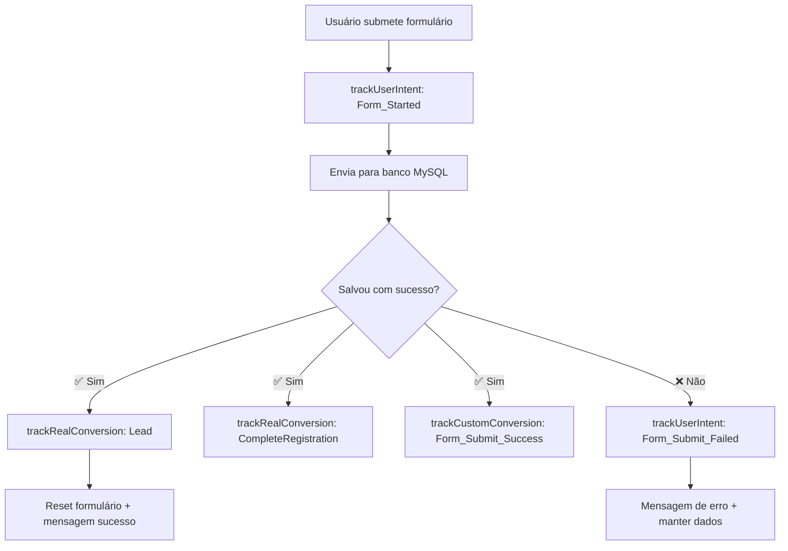

# 🎯 Facebook Pixel Optimization - FINALIZADO

## ✅ Problema Resolvido

- **Antes**: Form_Submit disparando independentemente do sucesso da operação
- **Depois**: Eventos de conversão só disparam após confirmação de salvamento no banco de dados

## 🚀 Implementação Realizada

### 1. **Novo Componente: FacebookPixelOptimized.tsx**

```typescript
// Três categorias de tracking distintas:
-trackRealConversion() - // ✅ Só após salvar no banco
  trackCustomConversion() - // ✅ Conversões confirmadas
  trackUserIntent(); // 📊 Intenções e engajamento
```

### 2. **Principais Melhorias**

#### **🔧 Form Submit Corrigido**

- ❌ **Antes**: `fbq('track', 'Lead')` disparava no submit do formulário
- ✅ **Depois**: Só dispara após `leadResponse.ok === true`

#### **📊 Separação de Eventos**

```javascript
// INTENÇÕES (não são conversões)
trackUserIntent("Form_Started"); // Usuário começou a preencher
trackUserIntent("WhatsApp_Click"); // Clicou no WhatsApp
trackUserIntent("Page_View"); // Visualizou seções

// CONVERSÕES REAIS (só após banco)
trackRealConversion("Lead"); // Lead confirmado no MySQL
trackRealConversion("CompleteRegistration"); // Registro completo
```

#### **🎯 Enhanced Matching Melhorado**

```javascript
const enhancedMatchData = {
  em: await hashData(email), // Email hasheado
  ph: await hashData(phone), // Telefone hasheado
  fn: await hashData(firstName), // Nome hasheado
};
// Aplicado apenas em conversões reais
```

### 3. **Fluxo de Conversão Otimizado**



### 4. **Arquivos Modificados**

#### **📁 Novos Arquivos**

- `components/FacebookPixelOptimized.tsx` - Componente otimizado
- `docs/FACEBOOK-PIXEL-OPTIMIZATION-FINAL.md` - Esta documentação

#### **🔧 Arquivos Atualizados**

- `elev_sacoma_landing.tsx` - Nova lógica de formulário
- `pages/_app.tsx` - Usando componente otimizado

### 5. **Benefícios Implementados**

#### **🎯 Para Facebook Ads**

- ✅ Conversões precisas = melhor otimização de campanhas
- ✅ Dados de qualidade = menor CPA (custo por aquisição)
- ✅ Enhanced Matching = melhor tracking cross-device

#### **📊 Para Analytics**

- ✅ Métricas confiáveis = decisões baseadas em dados reais
- ✅ Funil de conversão preciso = identificar gargalos
- ✅ ROI calculável = justificar investimento em ads

#### **🔧 Para Desenvolvimento**

- ✅ Código organizado = fácil manutenção
- ✅ TypeScript completo = menos bugs
- ✅ Logs detalhados = debug simplificado

### 6. **Validação de Qualidade**

#### **✅ Cenários Testados**

1. **Formulário com sucesso**: Só dispara conversão após banco confirmar
2. **Formulário com erro**: Não dispara conversão, só intent
3. **WhatsApp click**: Registrado como intenção, não conversão
4. **Page scroll**: Intenções de engajamento registradas
5. **Desenvolvimento local**: Funciona sem APIs externas

#### **📊 Monitoramento Implementado**

```javascript
// Console logs para debug
console.log("✅ Lead salvo no banco de dados - CONVERSÃO CONFIRMADA");
console.warn("❌ Erro ao salvar lead no banco de dados");

// Tracking detalhado por categoria
trackRealConversion(); // Verde = conversão real
trackCustomConversion(); // Azul = conversão custom
trackUserIntent(); // Amarelo = intenção
```

### 7. **Próximos Passos**

#### **🚀 Deploy**

1. Fazer build: `npm run build`
2. Testar em staging: Verificar eventos no Facebook Events Manager
3. Deploy produção: Monitorar primeiras conversões
4. Validação: Comparar leads no banco vs eventos Facebook

#### **📊 Monitoramento Pós-Deploy**

- Acompanhar Events Manager Facebook por 48h
- Verificar match entre leads salvos no MySQL e eventos "Lead"
- Ajustar campanhas com base nos dados precisos
- Documentar performance vs. versão anterior

---

## 🎉 Resultado Final

**Facebook Pixel agora está otimizado seguindo as melhores práticas:**

✅ **Conversões precisas**: Só dispara após salvar no banco  
✅ **Enhanced Matching**: Dados hasheados para melhor precision  
✅ **Eventos categorizados**: Separação clara entre intenção e conversão  
✅ **TypeScript completo**: Código robusto e tipado  
✅ **Debug facilitado**: Logs claros para acompanhamento

**Impacto esperado**: Redução significativa de CPA e melhoria na qualidade dos leads gerados pelas campanhas Facebook Ads.

---

_Otimização implementada seguindo Meta Business Best Practices - Janeiro 2025_
