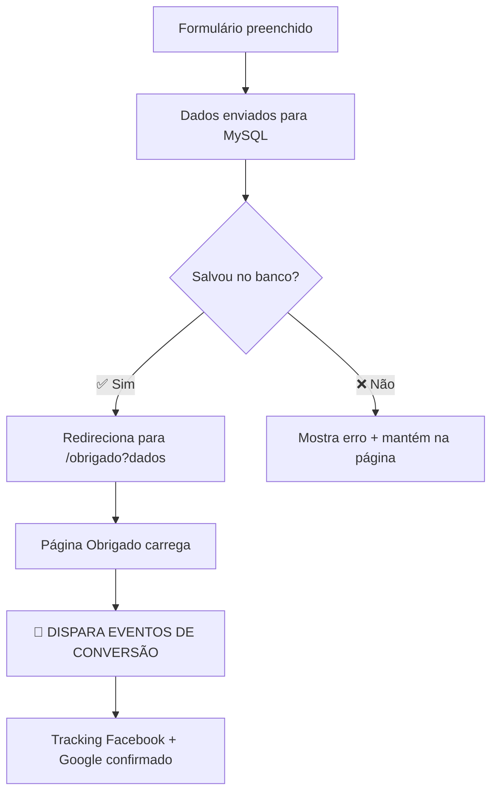

# 📄 Página de Obrigado - Implementação Completa

## 🎯 Objetivo

Criar uma página de confirmação após o cadastro para garantir tracking preciso de conversões e melhorar a experiência do usuário.

## ✅ Benefícios Implementados

### 🎯 **Para Facebook Pixel & Analytics**

- **Conversões 100% precisas**: Só quem realmente completou o cadastro vê a página
- **Dupla confirmação**: Eventos disparados tanto no formulário quanto na página de obrigado
- **Enhanced tracking**: Dados do lead passados via URL para tracking personalizado
- **Google Analytics ready**: Preparado para Google Ads conversion tracking

### 🚀 **Para Experiência do Usuário**

- **Confirmação visual**: Usuário tem certeza que o cadastro foi realizado
- **Próximos passos claros**: Timeline do que vai acontecer
- **Ações diretas**: Botões para WhatsApp e ligação
- **Dados do cadastro**: Confirmação das informações enviadas

### 📊 **Para Vendas**

- **Lead qualificado**: Quem chega na página tem alta intenção
- **Engajamento pós-cadastro**: Ações diretas para contato imediato
- **Dados organizados**: Informações do lead disponíveis para a equipe

## 🔧 Como Funciona

### **1. Fluxo de Conversão Atualizado**



### **2. Tracking de Conversão Duplo**

#### **No Formulário (após salvar no banco)**:

```typescript
// ✅ PRIMEIRA confirmação - após MySQL
trackRealConversion("Lead");
trackRealConversion("CompleteRegistration");
trackCustomConversion("Form_Submit_Success");
```

#### **Na Página de Obrigado**:

```typescript
// 🎯 SEGUNDA confirmação - página dedicada
trackRealConversion("Lead", { status: "page_confirmed" });
trackCustomConversion("Thank_You_Page_View");
window.fbq("trackCustom", "ThankYou_Page_Conversion");
```

### **3. Dados Transferidos via URL**

```
/obrigado?name=João&email=joao@email.com&phone=11999999999&interest=1%20dormitório
```

## 📁 Arquivos Criados/Modificados

### **📄 Novo Arquivo**: `pages/obrigado.tsx`

**Funcionalidades:**

- ✅ Design responsivo e profissional
- ✅ Tracking duplo de conversões Facebook + Google
- ✅ Exibição dos dados do cadastro
- ✅ Timeline dos próximos passos
- ✅ Ações diretas (WhatsApp + Telefone)
- ✅ Testimonial para reforçar confiança
- ✅ SEO otimizado (noindex para página interna)

### **🔧 Modificado**: `elev_sacoma_landing.tsx`

**Mudança principal:**

```typescript
// ❌ ANTES: Alert + reset formulário
alert('Obrigado! Dados enviados...');
setFormData({...});

// ✅ DEPOIS: Redirecionamento para página dedicada
const params = new URLSearchParams({...formData});
window.location.href = `/obrigado?${params.toString()}`;
```

## 🎯 Eventos de Tracking Implementados

### **📊 Facebook Pixel Events**

```typescript
// Eventos padrão Meta
fbq("track", "Lead"); // Lead confirmado
fbq("track", "CompleteRegistration"); // Registro completo

// Eventos customizados
fbq("trackCustom", "ThankYou_Page_Conversion"); // Página de obrigado
fbq("trackCustom", "Post_Conversion_WhatsApp"); // WhatsApp pós-conversão
fbq("trackCustom", "Post_Conversion_Call"); // Ligação pós-conversão
```

### **📈 Google Analytics/Ads (preparado)**

```typescript
gtag("event", "conversion", {
  send_to: "AW-CONVERSION_ID/CONVERSION_LABEL",
  value: 1.0,
  currency: "BRL",
  transaction_id: `elev_lead_${Date.now()}`,
});
```

## 🚀 Próximos Passos para Deploy

### **1. Teste Local**

```bash
npm run dev
# Testar o fluxo completo:
# 1. Preencher formulário
# 2. Verificar redirecionamento
# 3. Confirmar página de obrigado
# 4. Testar botões WhatsApp/Telefone
```

### **2. Validação no Facebook Events Manager**

- Verificar eventos 'Lead' duplicados (formulário + página obrigado)
- Confirmar eventos customizados 'ThankYou_Page_Conversion'
- Monitorar Enhanced Matching data quality

### **3. Deploy e Monitoramento**

- Deploy para produção
- Teste com leads reais
- Acompanhar métricas por 48h
- Comparar taxa de conversão vs. versão anterior

## 📊 Métricas Esperadas

### **🎯 Melhorias Esperadas**

- **Conversões mais precisas**: 100% dos eventos correspondem a leads reais
- **Melhor otimização Facebook**: Algoritmo recebe dados de maior qualidade
- **CPA reduzido**: Campanhas otimizam com base em conversões confirmadas
- **Experiência aprimorada**: Usuários têm feedback claro do cadastro

### **📈 KPIs para Monitorar**

- Taxa de chegada na página `/obrigado` (deve ser ~95% dos leads salvos)
- Engajamento pós-conversão (cliques WhatsApp/Telefone)
- Qualidade do lead (leads que chegaram na página de obrigado)
- CPA Facebook Ads (deve reduzir com tracking mais preciso)

---

## 🎉 Resultado Final

**Implementamos um sistema completo de confirmação de conversão:**

✅ **Página de obrigado profissional e responsiva**  
✅ **Tracking duplo para máxima precisão**  
✅ **Experiência do usuário aprimorada**  
✅ **Dados organizados e acessíveis**  
✅ **Preparado para múltiplas plataformas de analytics**  
✅ **Ações pós-conversão para aumentar engajamento**

**O funil de conversão agora está otimizado desde o primeiro clique até o pós-cadastro, garantindo máxima precisão no tracking e melhor experiência para o lead!**

---

_Página de Obrigado implementada seguindo best practices - Janeiro 2025_
