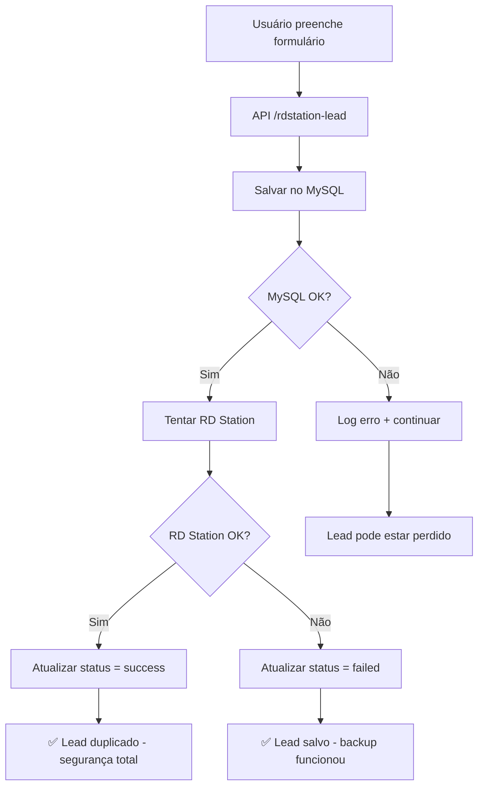

# 🔍 **Guia de Teste - Sistema de Backup MySQL**

## 📋 **Checklist de Configuração**

### **✅ 1. Banco de Dados Hostinger**
- [ ] Banco `elev_leads_db` criado
- [ ] Usuário `elev_user` configurado
- [ ] Senha segura definida
- [ ] Tabelas `leads` e `error_logs` criadas
- [ ] phpMyAdmin acessível

### **✅ 2. Variáveis de Ambiente**
Arquivo `.env.local`:
```bash
DB_HOST=localhost
DB_NAME=elev_leads_db
DB_USER=elev_user
DB_PASSWORD=[SUA_SENHA]
DB_PORT=3306
```

### **✅ 3. Dependências**
```bash
npm install mysql2
```

---

## 🧪 **Testes de Funcionamento**

### **Teste 1: Verificar APIs**
```bash
# Testar se o servidor Next.js roda sem erro
npm run dev
```

### **Teste 2: Dashboard de Leads**
Acesse: `http://localhost:3000/api/leads-dashboard`

**Resposta Esperada (Banco Vazio)**:
```json
{
  "success": true,
  "message": "Dashboard de leads carregado com sucesso",
  "data": {
    "leads": [],
    "statistics": {
      "total_leads": 0,
      "rd_station": {
        "success": 0,
        "failed": 0,
        "pending": 0,
        "success_rate": "0%"
      }
    }
  }
}
```

### **Teste 3: Simulação de Lead**
Use o Postman ou curl:

```bash
curl -X POST http://localhost:3000/api/rdstation-lead \
  -H "Content-Type: application/json" \
  -d '{
    "email": "teste@gmail.com",
    "name": "João Teste",
    "mobile_phone": "11999999999",
    "cf_interest_type": "2 dormitórios",
    "cf_source": "Landing Page Teste"
  }'
```

**Resposta Esperada**:
```json
{
  "success": true,
  "message": "Lead enviado com sucesso para RD Station e salvo no backup",
  "backup_saved": true,
  "lead_id": 1
}
```

---

## 📊 **Verificações no phpMyAdmin**

### **1. Verificar Lead Salvo**
```sql
SELECT * FROM leads ORDER BY created_at DESC LIMIT 5;
```

### **2. Verificar Status RD Station**
```sql
SELECT 
  name, email, rd_station_status, created_at 
FROM leads 
ORDER BY created_at DESC;
```

### **3. Verificar Logs de Erro**
```sql
SELECT * FROM error_logs ORDER BY created_at DESC LIMIT 10;
```

---

## 🚨 **Troubleshooting**

### **Erro: "Falha na conexão com banco de dados"**
1. Verificar se MySQL está ativo na Hostinger
2. Confirmar credenciais no `.env.local`
3. Testar conexão direta no phpMyAdmin

### **Erro: "Table 'leads' doesn't exist"**
1. Acessar phpMyAdmin
2. Executar scripts SQL do arquivo `DATABASE-SETUP.md`
3. Verificar se tabelas foram criadas

### **RD Station retorna erro, mas MySQL funciona**
✅ **ISSO É NORMAL!** O objetivo é:
- Lead SEMPRE salvo no MySQL
- RD Station como bonus (se funcionar)

---

## 📈 **Fluxo de Funcionamento**



---

## 🎯 **Próximos Passos**

1. **Configurar banco na Hostinger** seguindo `DATABASE-SETUP.md`
2. **Copiar `.env.example` para `.env.local`** e configurar credenciais
3. **Rodar testes** deste guia
4. **Fazer deploy** com banco configurado
5. **Monitorar leads** via phpMyAdmin

---

## 🏆 **Vantagens Implementadas**

✅ **Zero Perda de Leads**: Todo lead salvo no MySQL
✅ **Redundância**: MySQL + RD Station
✅ **Auditoria**: IP, User Agent, timestamps
✅ **Relatórios**: Dashboard via API
✅ **Log de Erros**: Troubleshooting facilitado
✅ **LGPD**: Dados no Brasil (Hostinger)

**Agora você tem um sistema robusto que NÃO PERDE leads!** 🚀
